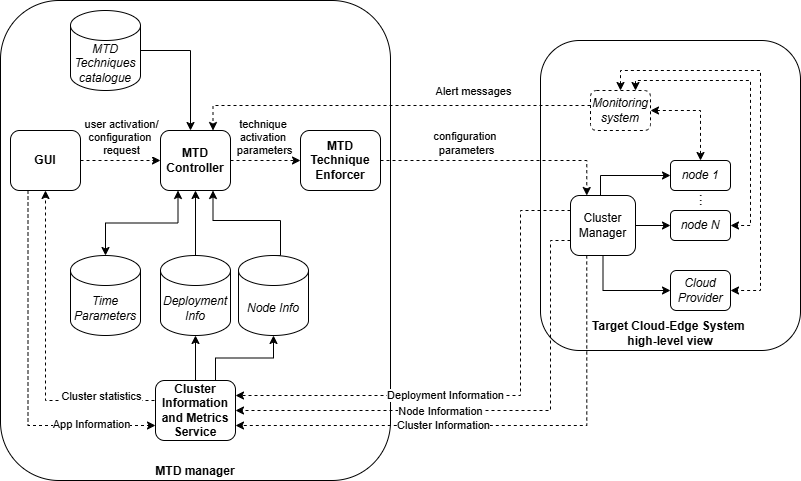
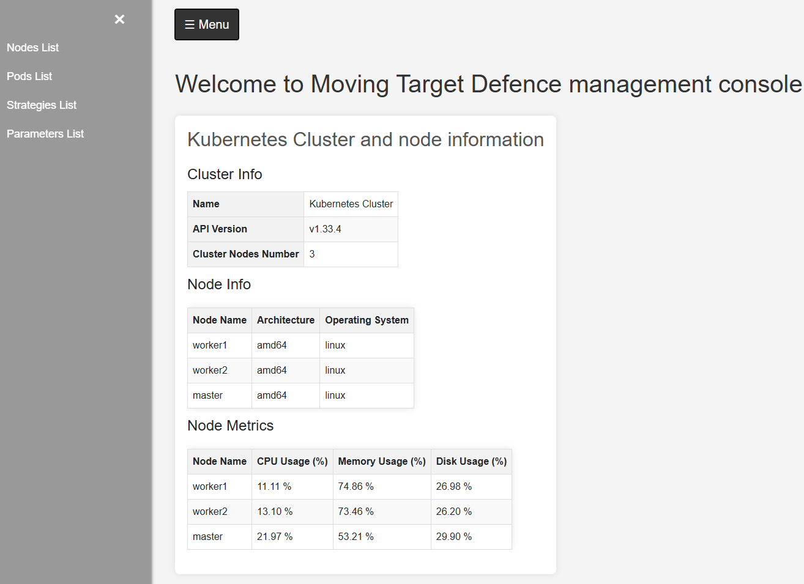
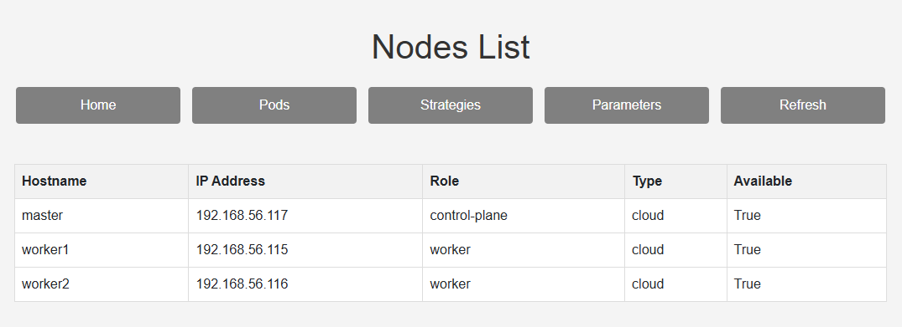
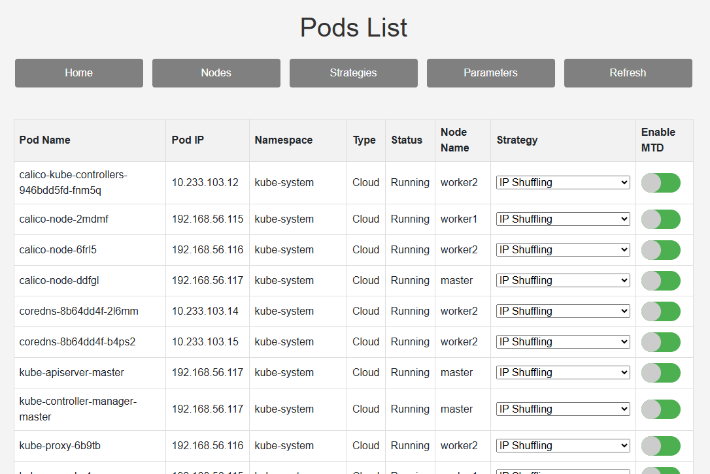
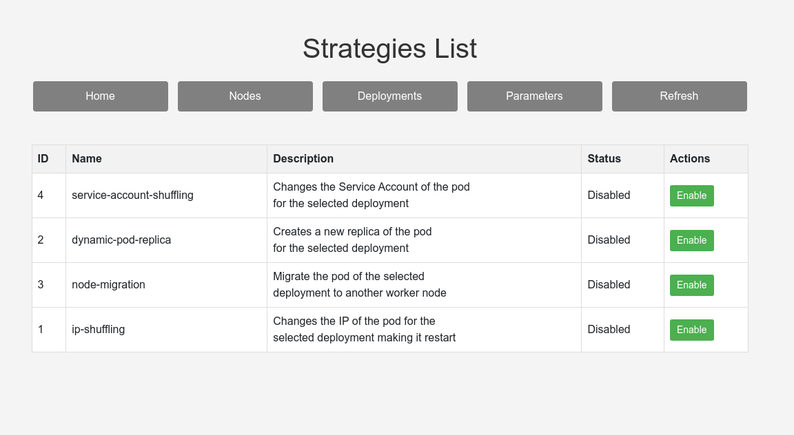
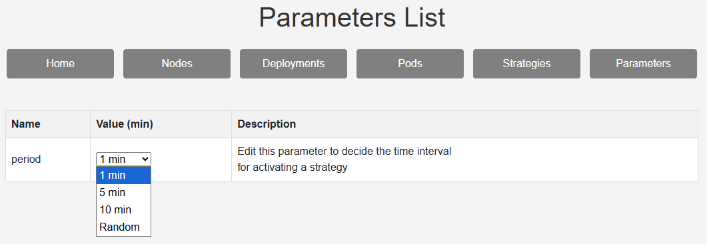

# MTD-manager-console
This is a JAVA application for managing the Moving Target Defense in a cloud environment developed in collaboration with `University of Naples Federico II` in the context of [DEFEDGE - PRIN PNRR 2022 Project](https://github.com/DEFEDGE) (reference author daniele.iorio2@unina.it).
 
To use this application, you need to install a kubernetes cluster following this file [How to Kubernetes](Setups/How_to_kubernetes.md) and set up the environment following [Framework setup](Setups/Framework_setup.md).

The connection between the cluster and the framework can be described as follows.


The implemented techniques are:
1. `IP shuffling` (Changes the IP of the pod for the selected deployment, making it restart)
2. `Service Account shuffling` (Changes the Service Account of the pod for the selected deployment)
3. `Dynamic Replica` (Creates a new replica of the pod for the selected deployment)
4. `Node Migration` (Migrate the pod of the selected deployment to another node matching the origin node type)

The application is intuitive and easy to use.
- The `landing page` is the following:



in which information about the cluster and the single node is automatically retrieved.

- In the `Nodes List` page, the user can access the information of the active nodes in the cluster.



- In the `Pods List` page, the user can access the information for each pod installed in the cluster and can decide on which of them MTD will be enabled.

  

- In the `Strategies List` page



the user can enable one (or more) strategy that will affect the enabled deployment.
In this case, the user cannot edit the strategy directly in the UI but needs to modify the source code to change/add implementation logic.
Whenever a new strategy is created, the following steps are needed:
1. the new classNameService.java file implementing the technique must be stored in the `src/main/java/mtd/manager/service` folder
2. insert in the `PGAdmin database` the new corresponding technique using the following query in the proper tool of the web page 
   ```sql
   INSERT INTO mtdmanager.strategy VALUES ('techniqueName', false, 'fixed', <n>);
   ```
   where "n" is the progressive technique number 
3. modify `src/main/resources/public/deplo.js` script to adapt the dropdown menu to the new scenario, adding
   ```js
   <option value="n" ${deployment.strategy === n ? 'selected' : ''}>techniqueName</option>
   ```
   after row 35.
4. in `src/main/resources/public/strats.js` script add the strategy description with the ID provided in `const strategyDescriptions`:
   ```js
   ID: 'Strategy description',
   ```
5. in `src/main/resources/public/add-deployment.js` update the function `isValidStrategy` (row 14), adding the numbers of the new technique.
6. in `src/main/java/mtd/manager/service/MTDStrategyService.java` add a new related thread to activate the service itself upon startup with
   ```java
   new Thread(classNameService, "name_alias").start();
   ```

- In the `Parameter` page



the user can set the preferred execution window.

---
## Reference
[1] Casola, V., De Benedictis, A., Iorio, D., Migliaccio, S.: A moving target defense framework to improve resilience of cloud-edge systems. In: Barolli, L. (ed.) Advanced Information Networking and Applications. pp. 243–252. Springer Nature Switzerland, Cham (2025). [DOI](https://doi.org/10.1007/978-3-031-87778-0_24) 
