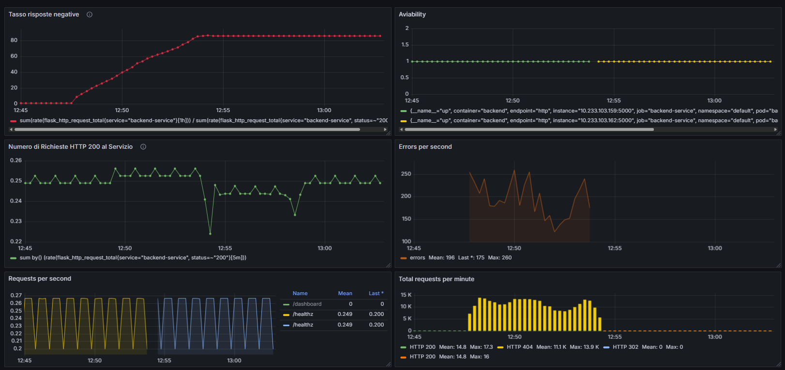
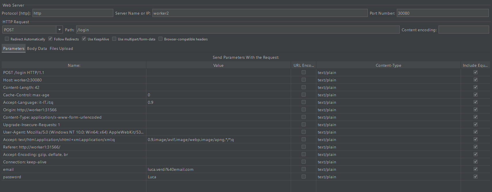
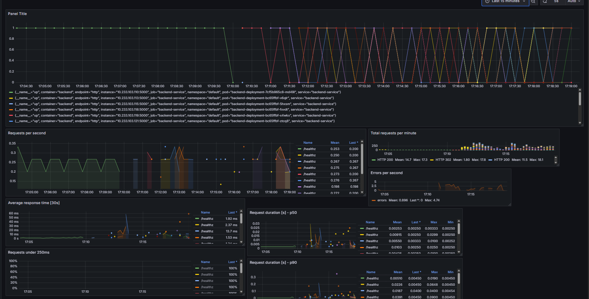

# This file provides a guide to attack a pod in the cluster

## 1. Attack example using the kali pod
1. Install a kali (yaml file in `miscConfig/kali-pod.yaml`) pod and access it:
   ```sh
   kubectl create namespace attack
   kubectl apply -f kali-pod.yaml --namespace attack
   kubectl exec -it kali -n attack -- bash
   ```
2. since it is an attacker used to test the system run:
   ```sh
     apt update
     apt install -y curl
     apt install -y nmap
     apt install -y hping3
     apt install -y sqlmap
     apt install -y apache2-utils
   ```
3. find the IP and the SERVICE PORT of the target pod and then you can run for example:
   ```sh
     curl http://<POD_IP>:<SERVICE_PORT>
     nmap -p 1-65535 <POD_IP>
     timeout 6000 ab -n 1000000 -c 100 http://<POD_IP>:<SERVICE_PORT>/
   ```
   <POD_IP> is located in the attributes of the pod itself while the <SERVICE_PORT> can be found in the related service tab. The last command simulates a DoS attack.

## 2. DDoS attack 
As our first case study, we simulated a Denial-of-Service (DoS) attack targeting a single backend pod directly. Although Kubernetes services and internal load balancing (including that managed by KubeSphere) make a direct attack on a single pod from the outside or from other internal pods more complex in real-world scenarios with multiple replicas, we chose this targeted approach to isolate and observe the specific impact on a deployment unit. The attack methodology used the **ApacheBench (ab)** web server benchmarking tool, executed with the following command:

```bash
timeout 3600 ab -n 1000000 -c 100 http://<IP>:<PORT>/
```
This command instructs ApacheBench (`ab`) to send a total of 1 million requests (`-n 1000000`) with a concurrency level of 100 parallel requests (`-c 100`) to a specific URL (`http:// :<PORT>/`), which in our case was the internal IP address and port of an isolated backend pod. The command execution was limited to a maximum of 3600 seconds (`timeout 3600`).

By monitoring the **Grafana** dashboards in real time, we were able to observe the effects of the attack. The targeted pod quickly showed high load and signs of instability, leading to its automatic restart by the Kubernetes pod management mechanism (probably due to the failure of liveness or readiness probes, or exceeding resource limits if configured). The graphs, particularly those related to availability and the number of requests handled, showed an interruption in the service provided by that specific pod starting at approximately 12:45 p.m.



In response to this anomaly and after monitoring the impact of the attack on the metrics, we manually activated an MTD strategy based on **IP-Shuffling**. In this context, IP-Shuffling was achieved by leveraging Kubernetes' ability to dynamically replace pods. The action consisted of forcibly deleting the pod under attack. Following the deletion, the Deployment Controller automatically created a new backend pod to maintain the desired number of replicas. The key point is that this new pod was started with a **new internal IP address** different from that of the previous pod.

The effect of this defense strategy was immediately visible in the Grafana graphs. After a short transition period due to the pod restart (about 15 seconds, as observed by the graphs showing activity resuming around 1:00 p.m.), requests began to be handled normally by the new pod. This demonstrated how the attack, which was directed at the specific IP of the old pod, lost its effective target as soon as the pod was replaced with a new one with a different IP.

This test confirmed that MTD based on target shifting, even in a simple form such as restarting a pod (which changes its IP), can mitigate attacks that depend on persistence on a specific network address. It is important to note that restarting a pod involves closing active connections to it. In addition, Kubernetes/KubeSphere's internal load balancing already helps distribute traffic across healthy pods in a Service, making it more difficult for an internal attacker to saturate a single pod without directly targeting its IP. The monitoring setup with Grafana proved indispensable for visualizing the precise impact of the attack, the temporary “blackout,” and the restoration of service by the new defended pod. The metrics collected could, in a more advanced implementation, be used to automatically trigger MTD responses when certain alert thresholds are exceeded.

### Simulation of a DDoS Attack on the Service with JMeter and Limitations of Replication-Based Defense

As an additional test, we conducted a simulation of a more intense Distributed Denial-of-Service (DDoS) attack using the **JMeter** tool. The goal was to generate a massive volume of traffic directed directly at the backend **Service**, exploiting its external exposure via NodePort, to evaluate its resilience under extreme load. The specific HTTP request used for this test was as follows:



The configuration of JMeter's **Thread Group** was defined to simulate a significant load of concurrent users:

- **ThreadGroup.num_threads:** 100 concurrent virtual users.
- **ThreadGroup.ramp_time:** 25 seconds to gradually start all 100 users.
- **ThreadGroup.duration:** 500 seconds total test duration.
- **ThreadGroup.scheduler:** true (to respect the total duration).
- **LoopController.loops:** -1 (infinite loop, effective for the total duration).
- **on_sample_error:** continue (the test continues even if there are errors in individual requests).

Under the load generated by JMeter, the backend service quickly became saturated and unresponsive. To counter this DDoS attack, we attempted to implement a defense strategy based on **increasing the number of replicas** of the backend deployment, scaling the number of pods horizontally from 1 to 10 and then to 20 replicas.

By monitoring the **Grafana** dashboards during the attack (see the image below, where the different colors indicate the metrics for the different replicas of the backend-service pods), we observed that, despite the increase in instances, the service continued to experience availability issues and it was impossible to establish functional connections.



We believe that the limited effectiveness of this defense, in contrast to the success of IP-Shuffling in the previous test, is mainly due to the nature of the attack, which targeted the Service as a whole rather than a specific single pod, and to the limitations of the computational resources available in our test environment. A DDoS attack of this magnitude saturates the aggregate processing and response capacity of the service. Although adding replicas distributes the load, each replica requires resources; if the total resources on the worker nodes are insufficient to sustain such a high load even with many instances, scaling alone is not enough. It is likely that effectively mitigating a DDoS attack of this intensity would require a significantly larger number of replicas supported by an infrastructure with hardware resources considerably greater than those of our test setup.

This simulation highlighted the limitations of MTD strategies based on simple horizontal scaling against large volumetric attacks and the importance of infrastructure sizing.
