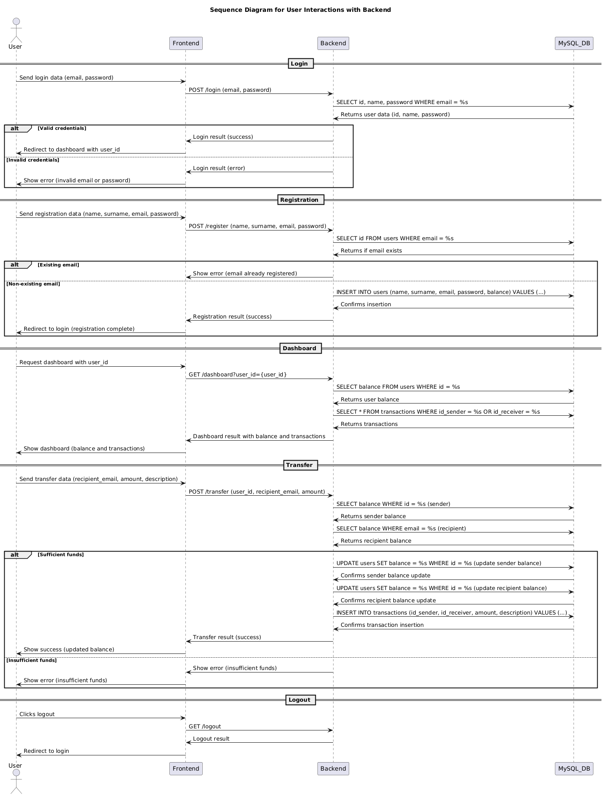

# Application logic
To clearly illustrate the application's operational flow and the interactions between its components, a sequence diagram has been created.

The diagram details the sequences of messages exchanged between the User (interacting with the Frontend), the Backend, and the MySQL Database for the main operations:

* **Login:** User authentication process.
* **Registration:** Creation of a new user account.
* **Dashboard:** Request and display balance and transaction list.
* **Transfer:** Execution of a funds transfer between users, including checks on sufficient balance and database updates.
* **Logout:** Termination of the user session.

This diagram is essential for understanding the expected behavior of the application and for identifying potential attack points on which to focus MTD testing and strategies.

# Analysis of Potential Attacks

A crucial step in preparing the environment for MTD testing is identifying potential attack vectors. A preliminary analysis was conducted to map viable or theoretical vulnerabilities related to each component of the banking platform and underlying infrastructure, assessing their potential impact and linking them to metrics relevant to defense assessment.

### Frontend (Web Interfaces and API Requests)

The Frontend component, being directly accessible by the user, presents several attack surfaces. Common vulnerabilities include Phishing/Page Spoofing, Cross-Site Scripting (XSS) due to potential lack of input sanitization in visible fields, and Session Hijacking/Token Leak, aggravated in our case by the exposure of the token in the URL. Client-side manipulation of JavaScript code is another risk. The management of API requests to the backend presents risks such as CORS bypass and the aforementioned token leak.

### Backend (Flask API)

The backend is the heart of the application logic and, therefore, a primary target. The Login and Registration endpoints are susceptible to Credential Stuffing/Brute Force (if not mitigated), SQL Injection (if not properly parameterized, even if prepared statements were used), and vulnerabilities related to user enumeration via timing or error messages. The Transfer endpoint is particularly sensitive, with risks of CSRF (if specific protections are not implemented), ID Spoofing, Race Conditions, and issues related to the validation of numeric fields or recipients (Negative Transfer/Transfer Self). The Dashboard endpoint presents risks of Token Forgery/Replay and Insufficient Authentication Check. Cross-cutting aspects of backend security such as Logging can expose sensitive data if not handled correctly.

### Database (MySQL)

The Database is the most critical asset for data integrity and confidentiality. Direct vulnerabilities include the possibility of brute force attacks on password hashes (if weak) and, above all, SQL injection attacks that aim to compromise the entire database. Direct manipulation of data in tables, such as log tampering in the transaction table or data injection via unvalidated fields, poses a significant threat to integrity.

### Infrastructure / Kubernetes

The underlying infrastructure and Kubernetes management also present attack vectors. At the Pod and Resource level, the exposure of Secrets or the predictability of pod scheduling via nodeAffinity/nodeSelector are risks. Resource Exhaustion attacks can impact availability. Networking is a critical point; direct access via NodePort exposes services, lack of traffic encryption (such as TLS/SSL) makes Man-in-the-Middle (MitM) attacks possible, and inter-Pod Port Scanning could reveal exposed internal services. Finally, the management of Persistent Volumes (PV) and Persistent Volume Claims (PVC) must be secure to avoid compromised data persistence or unauthorized access to persistent data from other pods.

For a detailed example of DDoS attack, refer to [step 2 of the attack guide](Attack.md)

# Security Requirements and Controls Implemented

During the development of the test banking application, certain security requirements were considered and implemented based on standard controls, referring, for example, to the security controls outlined by NIST. The following tables summarize the main requirements implemented for each backend endpoint and cross-cutting aspects, along with related NIST controls and a description of the specific implementation.

### Login Endpoint

| Requirement                       | NIST Control   | Control Description                                                 | Implementation                                                      |
| :-------------------------------- | :------------- | :------------------------------------------------------------------ | :------------------------------------------------------------------ |
| Password hash authentication      | IA-5           | Secure management of authenticators (e.g., password hashing).       | Use “check_password_hash” and “generate_password_hash” (Werkzeug).  |
| Email format validation           | SI-10          | Input validation to prevent malformed or malicious data.            | Regex “EMAIL_REGEX” to verify email format.                         |
| JWT token generation              | IA-2           | User identification and authentication via secure tokens.           | Tokens signed with “itsdangerous.URLSafeSerializer”.                |
| Secure error handling             | SI-10          | Error handling without exposing sensitive information.              | Redirect with encoded parameters.                                   |

### Register Endpoint

| Requirement             | NIST Control   | Control Description                                           | Implementation                                           |
| :---------------------- | :------------- | :------------------------------------------------------------ | :------------------------------------------------------- |
| Password hashing        | IA-5           | Secure storage of passwords using hashing functions.          | Use “generate_password_hash” to encrypt passwords.       |
| Email validation        | SI-10          | Input validation to prevent invalid email entries.            | Regex “EMAIL_REGEX” for format checking.                 |
| Email duplicate check   | AC-2           | Account management to prevent duplicate registrations.        | SQL query to check for email existence in the database.  |

### Dashboard Endpoint

| Requirement               | NIST Control   | Control Description                                         | Implementation                                                  |
| :-----------------------  | :------------- | :---------------------------------------------------------- | :---------------------------------------------------------------|
| Token Validation          | AC-3           | Restrict access to authorized users only.                   | Verify token using “validate_token” before returning data.      |
| Sensitive Data Protection | SC-28          | Protection of sensitive data during storage/transmission.   | Conversion from decimal to float to avoid serialization errors. |

### Transfer Endpoint

| Requirement                  | NIST Control   | Control Description                                             | Implementation                                                                  |
| :--------------------------- | :------------- | :-------------------------------------------------------------- | :------------------------------------------------------------------------------ |
| Authorization via token      | AC-6           | Limitation of operations to authorized actions only.            | Verification of correspondence between “user_id” in the token and in the form.  |
| Atomic transactions          | SC-24          | Transactional management to ensure data integrity.              | Use of “COMMIT” and “ROLLBACK” for atomic transactions.                         |
| Balance check                | AC-3           | Control of information flow to prevent unauthorized operations. | SQL query to verify balance before operation.                                   |

### Logout Endpoint

| Requirement         | NIST Control   | Control Description                          | Implementation                                                                            |
| :------------------ | :------------- | :--------------------------------------------| :---------------------------------------------------------------------------------------- |
| Token invalidation  | AC-12          | Secure termination of user sessions.         | Regeneration of the secret key (“token_serializer”), but previous tokens are not revoked. |

### Cross-cutting Aspects

| Requirement                          | NIST Control  | Control Description                                            | Implementation                                                                                           |
| :----------------------------------- | :------------ | :--------------------------------------------------------------| :------------------------------------------------------------------------------------------------------- |
| Restricted CORS                      | SC-7          | Limitation of allowed origins to prevent cross-domain attacks. | CORS configuration with origins limited to “http://worker1:31566”.                                       |
| Prepared statements                  | SI-10         | Prevention of SQL injection through parameterized queries.     | Use of “cursor.execute” with separate parameters (“%s”).                                                 |
| Backend error logging                | AU-3          | Error logging for forensic analysis.                           | Error logging via “app.logger.error”.                                                                    |
| Advanced input validation (XSS/SQLi) | SI-10         | Input sanitization to prevent XSS and injection.               | Basic sanitization with “sanitize_string”, but fields such as description are not validated against XSS. |
