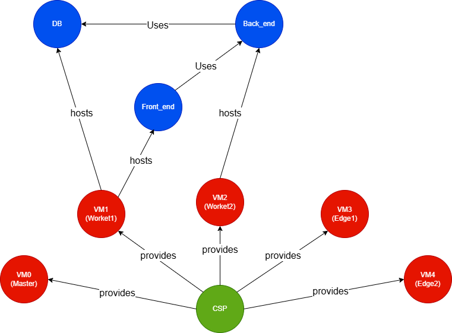

# Bank payment management system
This application simulates a money transfer system between registered users.

To install this application on the cluster, you need the yaml files in `miscConfig/bank`.

The following image describes at high level how the application is intended to be deployed using MACM formalism.


## 1. Initial Configuration in Kubesphere
Configuration of the necessary workspaces and projects within Kubesphere.

1.  Access the **Kubesphere Control Panel**.
2.  Navigate to `Platform` (top left corner) -> `Access Control`.
3.  Select `Workspaces` and click on `Create`.
    * Name the workspace `bank-workspace`.
    * Set `admin` as the **Administrator**.
    * Click `Create` to create the workspace.
4.  Access the newly created workspace (`bank-workspace`).
5.  Navigate to `Projects` -> `Create`.
    * Name the project `bank-project`.
    * Click `Create` to create the project.
---
  
## 2. Configure the `bank-project` Project

Within the `bank-project` project, we will enable the Gateway and configure a TLS Secret to grant HTTPS access.

### 2.1 Enabling the Project Gateway

The Gateway is required to exhibit project services outside the cluster.

1.  Inside `bank-project`, navigate to `Project Settings` -> `Gateway Settings`.
2.  Click on `Enable Gateway`.
3.  Confirm the operation by clicking `OK` or `Enable`.

### 2.2 Configure the TLS Secret for HTTPS

To enable secure access via HTTPS, a TLS certificate is needed. We will create a self-signed certificate for testing purposes.

1.  On the master node execute the following command to generate a self-signed certificate and private key:

    ```bash
    openssl req -x509 -nodes -newkey rsa:2048 -keyout tls.key -out tls.crt -days 365 -subj "/CN=bank.local"
    ```
    
    This command will create two files in the current directory: `tls.crt` (the certificate) and `tls.key` (the private key).
2.  Return to the Kubesphere UI, within `bank-project`.
3.  Navigate to `Configuration` -> `Secrets`.
4.  Click on `Create`.
    * Enter `https-secrets` as the **Name**.
    * Click `Next`.
    * Select `TLS Information` as the **Type**.
5.  Open the `tls.crt` file and copy the entire content including `-----BEGIN...-----` and `-----END...-----`.
6.  Paste the content of `tls.crt` into the section labeled **Certificate**.
7.  Open the `tls.key` file and copy the entire content including `-----BEGIN...-----` and `-----END...-----`.
8.  Paste the content of `tls.key` into the section labeled **Private Key**.
9.  Click `Create` to create the Secret.
---
## 3. Installing the Ingress-Nginx Controller

The Ingress Controller is responsible for managing external access to services exposed via Ingress Resources.

1.  On the master node, execute the following command to install the Ingress-Nginx Controller:

    ```bash
    kubectl apply -f https://raw.githubusercontent.com/kubernetes/ingress-nginx/controller-v1.1.1/deploy/static/provider/cloud/deploy.yaml
    ```

    This command will deploy the Ingress Controller into the `ingress-nginx` namespace.
2.  To verify the installation, return to the Kubesphere UI.
3.  Navigate to `Platform` -> `Cluster Management`.
4.  Select `Pods`. From the Namespace dropdown menu, choose `ingress-nginx`.
5.  You should see the pods related to the Ingress Controller (typically 3, with 2 `Completed` and 1 `Running`)
---
## 4. Configuring Local Access (Hosts File)

To access the application using the name `bank.local`, you need to map this name to the IP address of the node where the Ingress Controller is running in your local machine's `hosts` file.

1.  Open the `hosts` file on your local machine with administrator privileges:
    * **Windows:** `C:\Windows\System32\drivers\etc\hosts`
    * **Linux/macOS:** `/etc/hosts`
2.  Add a line in the format:
    ```
    <FRONTEND_WORKER_IP> bank.local
    ```
    Replace `<FRONTEND_WORKER_IP>` with the IP address of the frontend's worker node where the Ingress Controller is running.
3.  Save the `hosts` file.
---
## 5. Installing and Configuring the MySQL Database

We will install MySQL as the backend database for the application and configure the necessary tables.

1.  On the master node, create a Kubernetes Secret for the database credentials. This secret will be used by the application backend to connect to MySQL.

    ```bash
    kubectl create secret generic backend-secrets --from-literal=db_password='rootpassword' --from-literal=secret_key='rootpassword' -n bank-project
    ```

3.  Open the `mysql_deployment.yaml` file.
4.  Find the line containing `kubernetes.io/hostname: worker1` (typically around line 28) and modify `worker1` with the name of the specific node where you want the MySQL pod to run. This is useful for ensuring the persistent volume is always attached to the same node.
5.  Save the changes to the `mysql_deployment.yaml` file.
6.  Apply the MySQL deployment in the `bank-project` project:

    ```bash
    kubectl apply -f mysql_deployment.yaml -n bank-project
    ```

7.  Wait for the MySQL pod to be in the `Running` state. You can verify this in the Kubesphere UI (`bank-project` -> `Workloads` -> `Pods`) or with the command `kubectl get pods -n bank-project`. Note down the exact name of the pod (it will be something like `mysql-xxxxxxxxxx-xxxxx`).
8.  Access the shell of the MySQL pod:

    ```bash
    kubectl exec -it <MYSQL_POD_NAME> -n bank-project -- sh
    ```

    Replace `<MYSQL_POD_NAME>` with the exact pod name noted in the previous step.
9.  Once inside the pod's shell, access the MySQL client:

    ```bash
    mysql -u root -p
    ```

10. When prompted, enter the password for the `root` user, which is `rootpassword` (as defined in the Secret).
11. Once inside the MySQL console, view the existing databases:

    ```sql
    SHOW DATABASES;
    ```

12. The `bankdb` database should have been automatically created by the deployment (if it is not present, create it `CREATE DATABASE bankdb;`) and access it:

    ```sql
    USE bankdb;
    ```

13. Create the `users` table to store user information:

    ```sql
    CREATE TABLE users (
        id INT AUTO_INCREMENT PRIMARY KEY,
        name VARCHAR(50) NOT NULL,
        surname VARCHAR(50) NOT NULL,
        email VARCHAR(100) NOT NULL UNIQUE,
        password VARCHAR(255) NOT NULL,
        balance DECIMAL(10,2) NOT NULL DEFAULT 0.00
    );
    ```

14. Create the `transactions` table to record financial movements:

    ```sql
    CREATE TABLE transactions (
        id INT AUTO_INCREMENT PRIMARY KEY,
        id_sender INT NOT NULL,
        email_sender VARCHAR(255) NOT NULL,
        id_receiver INT NOT NULL,
        email_receiver VARCHAR(255) NOT NULL,
        amount DECIMAL(10,2) NOT NULL,
        date TIMESTAMP DEFAULT CURRENT_TIMESTAMP,
        description TEXT NULL
    );
    ```

15. (Optional) Populate the `users` table with some sample data:

    ```sql
    INSERT INTO users (name, surname, email, password, balance)
    VALUES
    ('Giovanni', 'Rossi', 'giovanni.rossi@email.com', 'pbkdf2:sha256:260000$D4kuLfbAZTEqwgNs$2a54fd573638b8579e8fe5065de2b98463ffb3063820938f6c2b965c969bbf2d', 500.00),
    ('Maria', 'Bianchi', 'maria.bianchi@email.com', 'pbkdf2:sha256:260000$cPNofnRIMNt88UYH$3bdcc1f225c222cb9cd1b9eac5f38e15434653848d01e81114c1a67eda0b2fc7', 1000.00),
    ('Luca', 'Verdi', 'luca.verdi@email.com', 'pbkdf2:sha256:260000$eWmItAkdLFqZhggI$d7e39d8c9e101f6bbb98e641c1ad2c476ff5aa172d5c955b27683944444340f2', 1500.00),
    ('Anna', 'Neri', 'anna.neri@email.com', 'pbkdf2:sha256:260000$vyyRyHIxtVKyr5Sk$11776308bf0b4a9d4bc6a6d6f02d2177db672ebcf0d8e1ea7be8679cf85af0fe', 2000.00),
    ('Marco', 'Gialli', 'marco.gialli@email.com', 'pbkdf2:sha256:260000$23uECGvUNaUrWLCb$2fda8024bec75830fe97d7279867652b2933dc00d870fbfa9968c643b8c1228e', 2500.00);
    ```

    **SECURITY NOTE:** Passwords in the database are stored in hashed format to ensure data security at rest. To log in to the application dashboard with the sample users above, **the password to use is the user's first name with the first letter capitalized** (e.g., for user "Giovanni Rossi" the email is `giovanni.rossi@email.com` and the password is `Giovanni`).
---

## 6. Deploying the Application (Frontend, Ingress, Backend)

Now we will deploy the application components and configure the Ingress Resource to route traffic.

1.  On the master node apply the frontend deployment in the `bank-project` project:

    ```bash
    kubectl apply -f frontend_deployment.yaml -n bank-project
    ```

3.  Apply the Ingress Resource in the `bank-project` project. This will create the rules to route traffic from the Ingress Controller to the appropriate services.

    ```bash
    kubectl apply -f ingress.yaml -n bank-project
    ```

4.  Determine the NodePort assigned to the Ingress Resource. Return to the Kubesphere UI.
    * Navigate to `bank-project` -> `Application Workloads` -> `Ingresses`.
    * Select the Ingress you just created.
    * On the main tab you can see information about the Ingress with something like `bank.local:<NodePort>`.
5.  Open the `backend_deployment.yaml` file.
6.  Find the section related to environment variables or frontend connection configuration (lines 59 and 61).
7.  Modify the text `<MODIFY HERE>` with the `<NodePort>` value. This tells the backend which port the application will be accessible on from the frontend via the Ingress.
8.  Save the changes to the `backend_deployment.yaml` file.
9.  Apply the backend deployment in the `bank-project` project:

    ```bash
    kubectl apply -f backend_deployment.yaml -n bank-project
    ```
---

## 7. Accessing the Application

Once all components have been deployed and are in the `Running` state (you can verify this in the Kubesphere UI in the Pods section of the `bank-project`), the application will be accessible.

1.  Open a web browser on the machine where you modified the `hosts` file.
2.  Navigate to the URL: `https://bank.local:<NodePort>`
    Replace `<NodePort>` with the actual NodePort you noted in step 6.4 (e.g., `https://bank.local:30662`).

You have successfully completed the deployment of the banking application on Kubesphere. You should now be able to access the application dashboard and, optionally, use the sample user credentials entered into the database to log in.

Now you can proceed to customize Grafana introducing new dashboards  [monitoring the application](Bank_Grafana_Setup.md).
