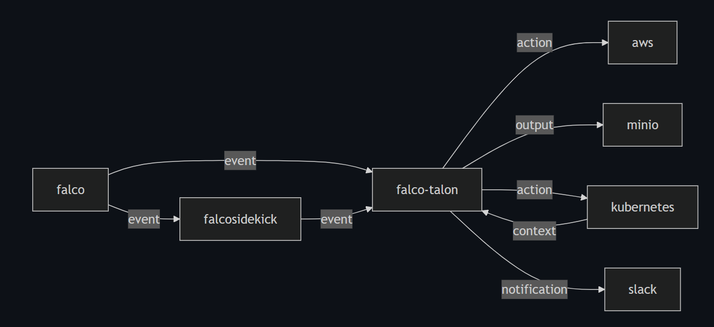

# Falco ecosystem high-level description
Main GitHub [repository](https://github.com/falcosecurity).

## Falco
Falco is a cloud native security tool that provides runtime security across hosts, containers, Kubernetes, and cloud environments. It is designed to detect and alert on abnormal behavior and potential security threats in real-time.

At its core, Falco is a monitoring and detection agent that observes events (such as Linux kernel events and other data sources through plugins) and delivers real-time alerts based on custom rules. Falco also enhances these events by integrating contextual metadata from container runtimes and Kubernetes. The generated alert events can be forwarded to other components to take action or be analyzed in SIEM or data lake systems for further investigation.

Falco, originally created by Sysdig, is now a graduate Cloud Native Computing Foundation (CNCF) project used in production by various organizations.

Useful links:
1. [Official docs](https://falco.org/docs/)
2. [Try Falco on Kubernetes](https://falco.org/docs/getting-started/falco-kubernetes-quickstart/)
3. [Falco Helm Charts](https://github.com/falcosecurity/charts)
4. [Falco Adopters](https://github.com/falcosecurity/falco/blob/master/ADOPTERS.md)
5. [Falco registered plugins](https://github.com/falcosecurity/plugins#registered-plugins)
6. [Dataset](https://github.com/simabagheri1/Falco-Alerts-Dataset-with-APT-attacks)

## Falco Sidekick
Falcosidekick is a proxy forwarder that acts as a central point for any fleet of Falco instances, using their HTTP outputs to send alerts.

It supports forwarding alerts to various outputs such as chat platforms, alerting systems, logs, storage services, and streaming systems.

Useful links:
1. [Sidekick homepage](https://falco.org/docs/concepts/outputs/forwarding/) 
2. [Official GitHub repo](https://github.com/falcosecurity/falcosidekick)

## Falco Talon
Falco Talon is a Response Engine for managing threats in Kubernetes clusters. It enhances the solutions proposed by the Falco community with a no-code tailor-made solution. With easy rules, you can react to events from Falco in milliseconds.

Useful links:
1. [Docs main page](https://falco.org/blog/falco-talon-v0-1-0/)
2. [Official GitHub repo](https://github.com/falcosecurity/falco-talon)

Environment configuration example

